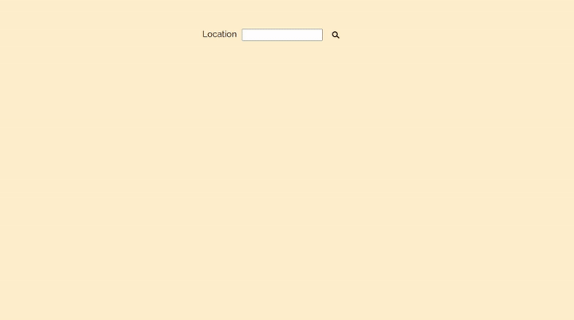
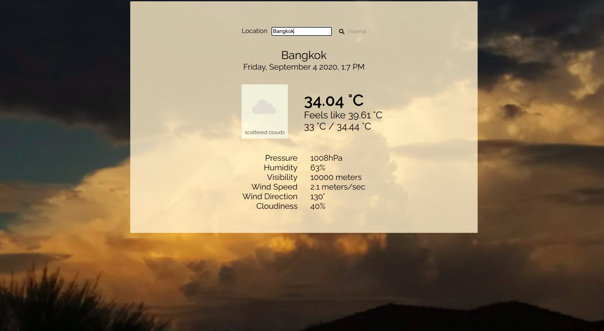

# Weather App

> A client side, JavaScript app that queries the OpenWeatherMap API for the current weather conditions in a given location. 

This application demonstrates the process of consuming an API and presenting the information received in a clean interface.

## Built With

- HTML, CSS and JavaScript
- OpenWeatherMap API
- Unsplash API

## Live Demo

[Live Demo Link](https://deploy-preview-1--festive-pasteur-77b125.netlify.app/)

## Getting Started

- Clone this repository. 
- Switch to the `weather-app` branch. 
- Install all dependancies by running `npm install`.
- Launch the project locally by running `npm run start`.

### Usage

- Enter the name of the location in the search bar.
- Click on the _metric_ button next to the search bar, that says `Imperial` (to switch to Imperial units) or `Metric` (to switch to metric units).

## Author

👤 **Keshav Chakravarthy**

- Github: [@keshav-c](https://github.com/keshav-c)
- Linkedin: [k3shavchakravarthy](https://www.linkedin.com/in/k3shavchakravarthy/)

## 🤝 Contributing

Contributions, issues and feature requests are welcome!

Feel free to check the [issues page](https://github.com/keshav-c/Weather-App/issues).

## Show your support

Give a ⭐️ if you like this project!

## Acknowledgments

- Microverse for reviewing the code
- The Odin Project for the assignment details
- OpenWeatherMap and Unsplash for great, easy to use APIs.

## 📝 License

This project is [MIT](https://opensource.org/licenses/MIT) licensed.